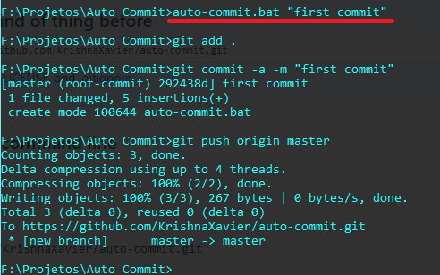

# Auto Commit
A line to write to your project.

Abra seu terminal, navegue até a pasta do seu projeto, copie o arquivo "auto-commit.bat" para dentro e execute o comando:
auto-commit.bat "seu comentario do commit".

