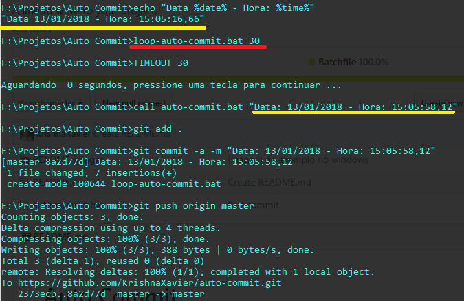

# Auto Commit
A line to write to your project.

Abra seu terminal, navegue até a pasta do seu projeto, copie o arquivo "auto-commit.bat" para dentro e execute o comando:

``` bash
auto-commit.bat "seu comentario do commit"
```


Para os programadores preguiçosos ou esquecidos temos a opção de commitar a cada x segundos.
Abra seu terminal, navegue até a pasta do seu projeto, copie o arquivo "auto-commit.bat" e "loop-auto-commit.bat" para dentro e execute o comando:

``` bash
loop-auto-commit.bat segundos
```

Onde <i>segundos</i> é um valor em segundos que o sistema vai esperar para commitar.<br>
Exemplo para commitar a cada 1 hora:

``` bash
loop-auto-commit.bat 3600
```


