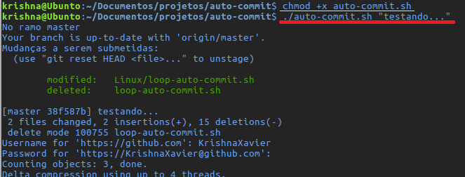

# Auto Commit
A line to write to your project.

##Windows
<ul>
  <li>Abra seu terminal</li>
  <li>Navegue até a pasta do seu projeto</li>
  <li>Copie o arquivo "Windows/auto-commit.bat" para dentro e execute o comando:</li>
</ul>

``` bash
auto-commit.bat "seu comentario do commit"
```


Para os programadores preguiçosos ou esquecidos temos a opção de commitar a cada x segundos.
<ul>
<li>Abra seu terminal</li> 
  <li>Navegue até a pasta do seu projeto</li>
  <li>Copie o arquivo "Windows/auto-commit.bat" e "Windows/loop-auto-commit.bat" para dentro e execute o comando:</li>
</u>

``` bash
loop-auto-commit.bat segundos
```

Onde <i>segundos</i> é um valor em segundos que o sistema vai esperar para commitar.<br>
Exemplo para commitar a cada 1 hora:

``` bash
loop-auto-commit.bat 3600
```


##Linux

<ul>
  <li>Abra seu terminal</li>
  <li>Navegue até a pasta do seu projeto</li>
  <li>Copie o arquivo "Linux/auto-commit.sh" para dentro</li>
  <li>Torne o arquivo executável com o comando:</li>
  
  ``` bash
    chmod +x auto-commit.sh
  ```
   <li>Execute o comando:</li>
  
  ``` bash
    auto-commit.sh "seu comentario do commit"
  ```
</ul>



###<i>Commite</i> periódico

<ul>
  <li>Abra seu terminal</li>
  <li>Navegue até a pasta do seu projeto</li>
  <li>Copie o arquivo "Linux/auto-commit.sh" para dentro</li>
  <li>Copie o arquivo "Linux/loop-auto-commit.sh" para dentro</li>
  <li>Torne os arquivos executáveis com o comando:</li>
  
  ``` bash
    chmod +x auto-commit.sh
    chmod +x loop-auto-commit.sh
  ```
   <li>Execute o comando:</li>
  
  ``` bash
    loop-auto-commit.sh segundos
  ```
</ul>


